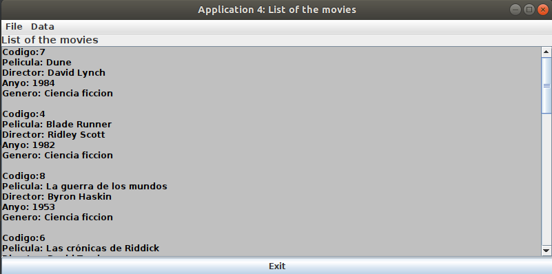
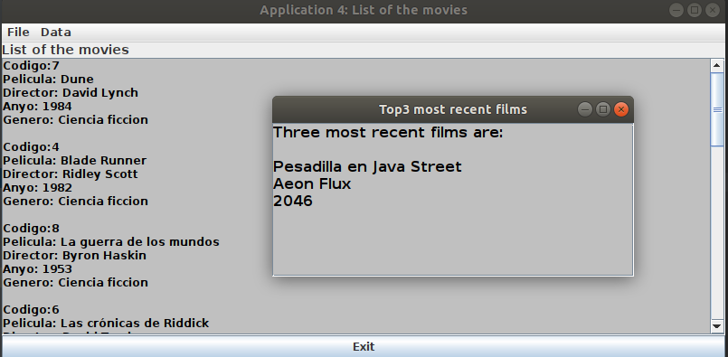
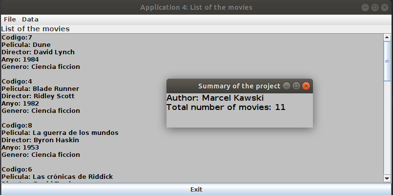

# ListOfMovies
Simple application displaying a list of movies made in MVC

## Table of contents
* [General info](#general-info)
* [Screenshots](#screenshots)
* [Technologies](#technologies)
* [Features](#features)

## General info
Project made for the subject Human Computer Interaction on the Universitat de Valencia during my Erasmus+ exchange. The project was made to get familiar with MVC software design pattern and with Swing and AWT layouts.

## Screenshots

## Technologies
* Java - version 13.0.1
* Swing
* AWT

## Features
* displaying a list of movies
* displaying 3 most recent films
* displaying a summary of the project

